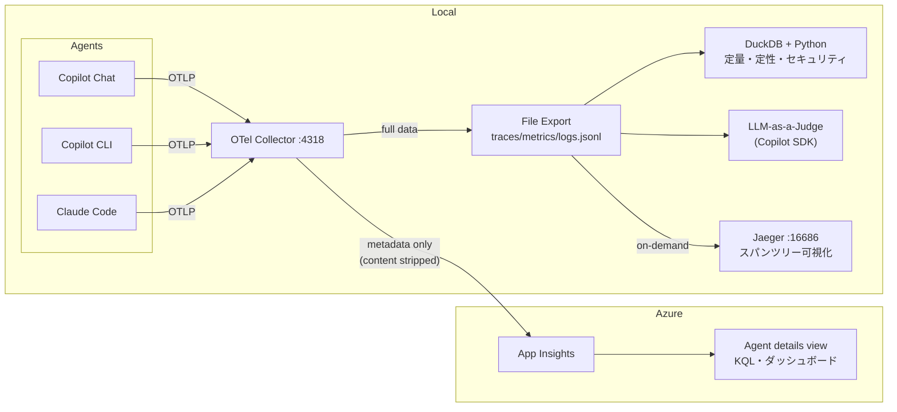

# ai-agent-otel

Copilot Chat / Copilot CLI / Claude Code の OTel テレメトリをローカル + Azure に集約・分析する環境。

## Architecture



- **ファイル**: コンテンツ込みフルデータ (正本)。DuckDB で分析
- **App Insights**: プロンプト/レスポンスを削除したメタデータのみ。Agent details view + KQL
- **Jaeger**: 必要時のみ起動。ファイルから対象トレースを再生してスパンツリーを確認

## Prerequisites

- Docker
- [Azure Developer CLI (azd)](https://learn.microsoft.com/azure/developer/azure-developer-cli/install-azd)
- Azure サブスクリプション (App Insights 無料枠: 5GB/月)
- GitHub Copilot サブスクリプション
- Claude Code (optional)
- [uv](https://docs.astral.sh/uv/) (Python スクリプト実行用)

## Setup

### 1. Azure リソースをデプロイ

App Insights + Log Analytics をデプロイ。postprovision hook が `.env` に connection string を自動書き込み:

```bash
azd init    # 環境名とリージョンを設定
azd up      # デプロイ → .env 自動生成
```

#### 既存環境を別マシンで使う場合

```bash
azd init                # 同じ環境名を指定
azd env refresh         # Azure から既存デプロイの output を取得（再デプロイ不要）
```

`azd env refresh` 後に `.env` を生成するには postprovision hook を手動実行:

```bash
bash infra/hooks/postprovision.sh
```

#### connection string の確認

```bash
azd env get-value APPLICATIONINSIGHTS_CONNECTION_STRING
```

### 2. OTel Collector を起動

```bash
mkdir -p data
docker compose up -d
```

### 3. エージェントを設定

全エージェント共通の環境変数をシェルプロファイル + デスクトップセッションに注入:

```bash
./scripts/setup-env.sh install
source ~/.zshrc  # 現在のターミナルに反映
```

デスクトップランチャーから VS Code を起動する場合は、ログアウト→再ログインで `environment.d` を反映。または:

```bash
systemctl --user import-environment $(cat ~/.config/environment.d/ai-agent-otel.conf | cut -d= -f1 | tr '\n' ' ')
# → VS Code の再起動が必要
```

設定状況の確認 / 削除:

```bash
./scripts/setup-env.sh status     # 現在の環境変数を確認
./scripts/setup-env.sh uninstall  # 環境変数を削除
```

#### 補足: Claude Code の settings.json

Claude Code は `~/.claude/settings.json` の `env` ブロックでも設定できます。
シェル環境変数と重複しますが、`settings.json` 側が優先されます。

### 4. 動作確認

```bash
ls -la data/                      # jsonl ファイルが生成されているか
uv run scripts/analyze.py summary  # DuckDB でクエリできるか
```

## Usage

### 日次 (1-2分): App Insights で俯瞰

Azure Portal → Application Insights → **Agents (Preview)** を開く:

- トークン消費のグラフが急増していないか
- エラーのあるトレースがないか
- エージェント別の利用頻度

### 週次 (10-15分): DuckDB で分析

```bash
uv run scripts/analyze.py summary    # エージェント別サマリー
uv run scripts/analyze.py tools      # ツール呼び出しランキング
uv run scripts/analyze.py cost       # トークン消費 + USD コスト見積もり
uv run scripts/analyze.py security   # セキュリティ監査
uv run scripts/analyze.py direction  # ディレクション分析 (修正頻度)
```

### 気になった時: LLM-as-a-Judge で品質スコアリング

```bash
# 最新のトレースをスコアリング
uv run scripts/score.py

# 特定のトレースを指定
uv run scripts/score.py --trace-id <trace-id-prefix>

# プロンプトだけ確認 (Copilot 呼び出しなし)
uv run scripts/score.py --dry-run
```

Copilot SDK (gpt-4o-mini) で autonomy / efficiency / direction_needed / security の 4 軸を 1-5 でスコアリング。ツールは全拒否、OTel 送信 OFF で実行されるため副作用なし。

### 気になった時: Jaeger でスパンツリー可視化

```bash
docker compose --profile tools up -d jaeger  # 起動
uv run scripts/push_to_jaeger.py --recent 5  # 最近の 5 トレースを流す
uv run scripts/push_to_jaeger.py --trace-id <id>  # 特定トレース
open http://localhost:16686                  # ブラウザで確認
docker compose --profile tools stop jaeger   # 停止
```

Jaeger はインメモリのため再起動でデータは消えるが、ファイルが正本なのでいつでも再生可能。

## License

MIT License (see [LICENSE](LICENSE) for details)
