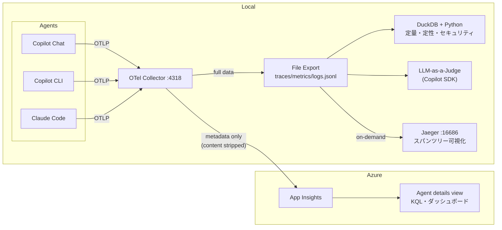

# ai-agent-otel

Copilot Chat / Copilot CLI / Claude Code の OTel テレメトリをローカル + Azure に集約・分析する環境。

## Architecture



- **ファイル**: コンテンツ込みフルデータ (正本)。`data/` ディレクトリに `traces.jsonl` / `metrics.jsonl` / `logs.jsonl` として出力。DuckDB で分析
- **App Insights**: プロンプト/レスポンスを削除したメタデータのみ。Agent details view + KQL
- **Jaeger**: 必要時のみ起動。ファイルから対象トレースを再生してスパンツリーを確認

## Prerequisites

- Docker
- [azd](https://learn.microsoft.com/azure/developer/azure-developer-cli/install-azd)
- [uv](https://docs.astral.sh/uv/)

## Setup

**→ [docs/setup.md](docs/setup.md)** を参照 (Windows / Linux それぞれの手順あり)

クイックスタート:

```bash
# Azure リソースデプロイ + .env 自動生成
azd up

# OTel Collector 起動
docker compose up -d

# OTel Collector へのエクスポートを環境変数で設定（シェルプロファイル + ユーザー環境変数）
./scripts/setup-env.sh install      # Linux
.\scripts\setup-env.ps1 install     # Windows (PowerShell)
```

## Usage

### 日次 (1-2分): App Insights で俯瞰

Azure Portal → Application Insights → **Agents (Preview)** を開く:

- トークン消費のグラフが急増していないか
- エラーのあるトレースがないか
- エージェント別の利用頻度

### 週次 (10-15分): DuckDB で分析

```bash
uv run scripts/analyze.py summary    # エージェント別サマリー
uv run scripts/analyze.py tools      # ツール呼び出しランキング
uv run scripts/analyze.py cost       # トークン消費 + USD コスト見積もり
uv run scripts/analyze.py security   # セキュリティ監査
uv run scripts/analyze.py direction  # ディレクション分析 (修正頻度)
```

### 気になった時: LLM-as-a-Judge で品質スコアリング

```bash
# 最新のトレースをスコアリング
uv run scripts/score.py

# 特定のトレースを指定
uv run scripts/score.py --trace-id <trace-id-prefix>

# プロンプトだけ確認 (Copilot 呼び出しなし)
uv run scripts/score.py --dry-run
```

Copilot SDK (gpt-4o-mini) で autonomy / efficiency / direction_needed / security の 4 軸を 1-5 でスコアリング。ツールは全拒否、OTel 送信 OFF で実行されるため副作用なし。

### 気になった時: Jaeger でスパンツリー可視化

```bash
docker compose --profile tools up -d jaeger  # 起動
uv run scripts/push_to_jaeger.py --recent 5  # 最近の 5 トレースを流す
uv run scripts/push_to_jaeger.py --trace-id <id>  # 特定トレース
open http://localhost:16686                  # ブラウザで確認
docker compose --profile tools stop jaeger   # 停止
```

Jaeger はインメモリのため再起動でデータは消えるが、ファイルが正本なのでいつでも再生可能。

## License

MIT License (see [LICENSE](LICENSE) for details)
